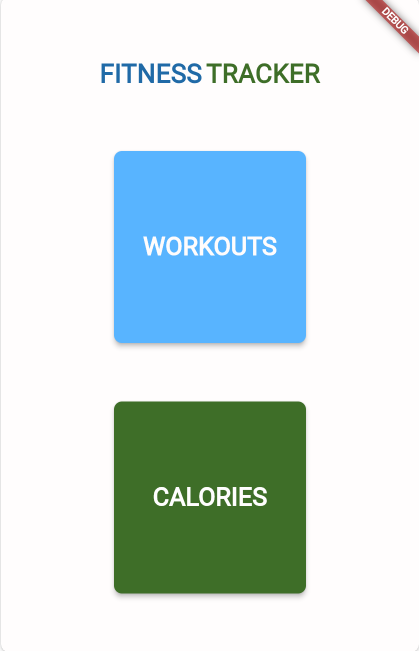
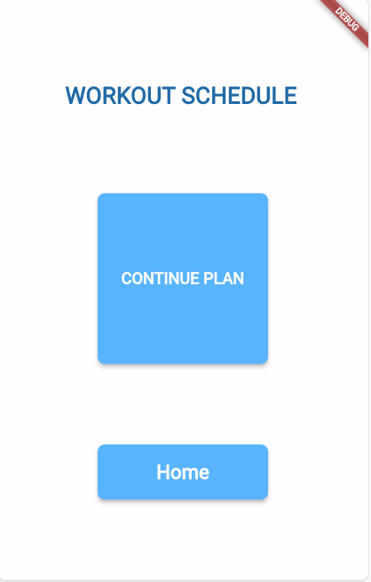
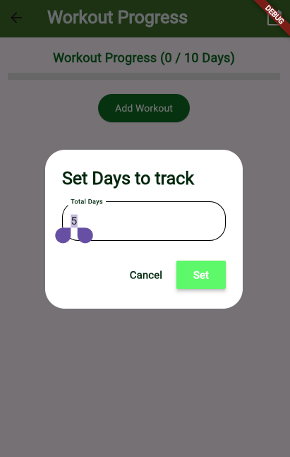
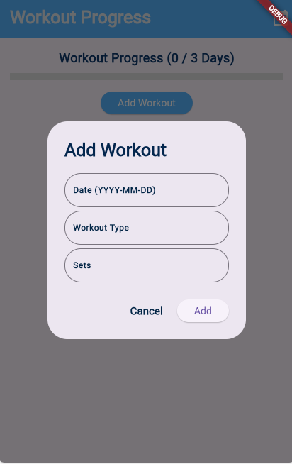
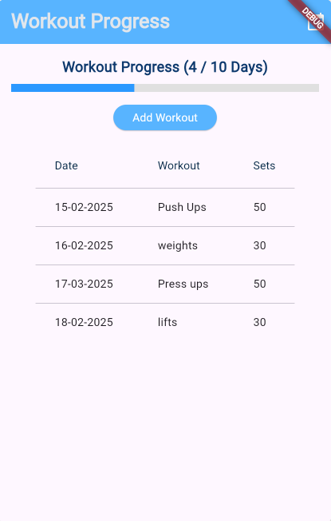
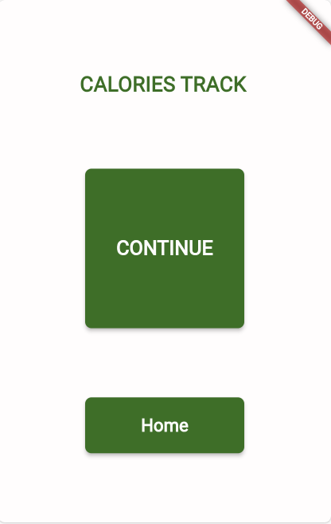
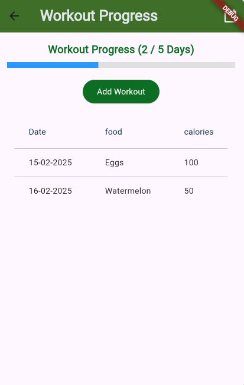

# Fitness Tracker App

## 📌 Overview

The Fitness Tracker App is a Flutter-based mobile application that allows users to track their workout sessions and calorie consumption. The app provides a user-friendly interface for logging workouts, setting goals, and monitoring progress with a visual progress bar.

## 🚀 Features

- **📅 Workout Logging:** Users can input daily workout details, including workout type and number of sets.
- **📊 Progress Tracking:** Tracks progress based on the number of workout days completed.
- **🎯 Goal Setting:** Allows users to define the total number of workout days.
- **🔥 Calorie Tracking:** Users can log and monitor calorie intake and expenditure.
- **📈 Visual Progress Indicator:** A linear progress bar to display fitness journey.
- **📝 Workout History Table:** Keeps a record of previous workouts for easy review.

## 🛠️ Installation Guide

### Prerequisites

Ensure you have the following installed:

- Flutter SDK ([Download Flutter](https://flutter.dev/docs/get-started/install))
- Dart SDK
- Android Studio or Visual Studio Code (recommended for Flutter development)

### Steps to Run the App

1. Clone the repository:
   ```sh
   git clone https://github.com/paramwas/fitness-tracker-app.git
   cd fitness-tracker-app
   ```

2. Install dependencies:
   ```sh
   flutter pub get
   ```

3. Run the app on a connected device or emulator:
   ```sh
   flutter run
   ```

## 📷 Screenshots


### Homepage


### Workout Confirmation


### Set Days


### Add Workout


### Track Workout Progress


### Calories Page


### Set Track


### Track Progress



## 🔍 How to Use

1. **Set Workout Plan:** Click the calendar icon to define your total workout days.
2. **Log a Workout:** Click the "Add Workout" button to input date, type of workout, and number of sets.
3. **Track Progress:** The progress bar updates as you complete more workout days.
4. **View History:** A table displays your workout records for easy tracking.
5. **Monitor Calories:** Add calorie intake/expenditure to maintain a balanced fitness plan.

## 💡 Future Enhancements


- 📉 Integration with wearable fitness trackers.
- 📱 Improved UI/UX for better user engagement.

